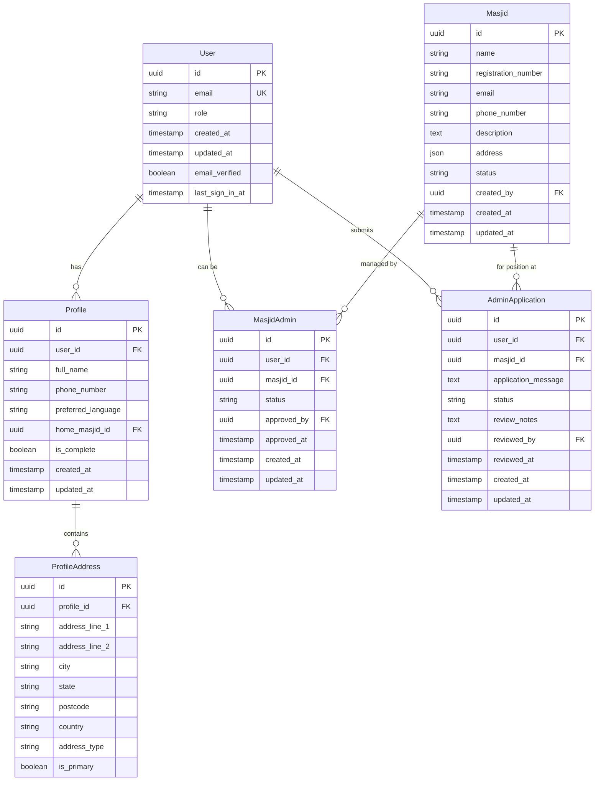

# Data Model: Masjid Suite Profile Management System

**Date**: 17 September 2025  
**Context**: Database schema design for user management and profile system

## Entity Relationship Overview



## Core Entities

### User (Supabase Auth Integration)
**Purpose**: Central user authentication and role management  
**Source**: Extends Supabase auth.users table

| Field | Type | Constraints | Description |
|-------|------|-------------|-------------|
| id | UUID | PRIMARY KEY | Supabase user ID |
| email | VARCHAR(255) | UNIQUE, NOT NULL | Email address |
| role | VARCHAR(50) | NOT NULL, DEFAULT 'public' | User role (super_admin, masjid_admin, registered, public) |
| created_at | TIMESTAMP | NOT NULL, DEFAULT NOW() | Account creation timestamp |
| updated_at | TIMESTAMP | NOT NULL, DEFAULT NOW() | Last update timestamp |
| email_verified | BOOLEAN | DEFAULT FALSE | Email verification status |
| last_sign_in_at | TIMESTAMP | NULL | Last login timestamp |

**Business Rules**:
- Super admin role is set via environment variable mapping
- Email must be valid and unique across system
- Role changes require super admin approval
- Public users can browse without full registration

**Indexes**:
- PRIMARY: id
- UNIQUE: email
- INDEX: role, created_at

### Profile
**Purpose**: Detailed user information and profile completion tracking

| Field | Type | Constraints | Description |
|-------|------|-------------|-------------|
| id | UUID | PRIMARY KEY | Profile identifier |
| user_id | UUID | FOREIGN KEY (User.id), UNIQUE | User reference |
| full_name | VARCHAR(255) | NOT NULL | Complete user name |
| phone_number | VARCHAR(20) | NULL | Malaysian format phone |
| preferred_language | VARCHAR(10) | DEFAULT 'en' | UI language preference |
| home_masjid_id | UUID | FOREIGN KEY (Masjid.id), NULL | User's home masjid |
| is_complete | BOOLEAN | DEFAULT FALSE | Profile completion status |
| created_at | TIMESTAMP | NOT NULL, DEFAULT NOW() | Profile creation |
| updated_at | TIMESTAMP | NOT NULL, DEFAULT NOW() | Last profile update |

**Business Rules**:
- Profile completion requires: full_name, phone_number, address, home_masjid_id
- Phone number must follow Malaysian format validation
- Users cannot access role-specific features until profile is complete
- Home masjid selection triggers notification to masjid admins

**Validation Rules**:
- full_name: 2-255 characters, supports Unicode
- phone_number: Malaysian format (+60-xx-xxxx-xxxx or 0xx-xxxx-xxxx)
- preferred_language: ISO 639-1 code (en, ms, zh, ta)

### ProfileAddress
**Purpose**: Malaysian address format storage with multiple address support

| Field | Type | Constraints | Description |
|-------|------|-------------|-------------|
| id | UUID | PRIMARY KEY | Address identifier |
| profile_id | UUID | FOREIGN KEY (Profile.id) | Profile reference |
| address_line_1 | VARCHAR(255) | NOT NULL | Primary address line |
| address_line_2 | VARCHAR(255) | NULL | Secondary address line |
| city | VARCHAR(100) | NOT NULL | City/town name |
| state | VARCHAR(50) | NOT NULL | Malaysian state |
| postcode | VARCHAR(5) | NOT NULL | 5-digit postcode |
| country | VARCHAR(3) | DEFAULT 'MYS' | ISO country code |
| address_type | VARCHAR(20) | DEFAULT 'home' | Address type (home, work, other) |
| is_primary | BOOLEAN | DEFAULT FALSE | Primary address flag |

**Business Rules**:
- Each profile must have exactly one primary address
- Postcode must be valid Malaysian postal code (10000-98000)
- State must be valid Malaysian state/territory
- Address validation follows Pos Malaysia standards

**Malaysian States Enum**:
- Johor, Kedah, Kelantan, Malacca, Negeri Sembilan, Pahang, Penang, Perak, Perlis, Sabah, Sarawak, Selangor, Terengganu, Kuala Lumpur, Labuan, Putrajaya

### Masjid
**Purpose**: Mosque entity management and registration

| Field | Type | Constraints | Description |
|-------|------|-------------|-------------|
| id | UUID | PRIMARY KEY | Masjid identifier |
| name | VARCHAR(255) | NOT NULL | Masjid name |
| registration_number | VARCHAR(50) | UNIQUE | Official registration |
| email | VARCHAR(255) | NULL | Contact email |
| phone_number | VARCHAR(20) | NULL | Contact phone |
| description | TEXT | NULL | Masjid description |
| address | JSONB | NOT NULL | Address information |
| status | VARCHAR(20) | DEFAULT 'active' | Masjid status |
| created_by | UUID | FOREIGN KEY (User.id) | Creator (super admin) |
| created_at | TIMESTAMP | NOT NULL, DEFAULT NOW() | Creation timestamp |
| updated_at | TIMESTAMP | NOT NULL, DEFAULT NOW() | Last update |

**Business Rules**:
- Only super admins can create masjids
- Registration number must be unique if provided
- Address follows same format as ProfileAddress
- Status can be: active, inactive, pending_verification

**Address JSON Structure**:
```json
{
  "address_line_1": "string",
  "address_line_2": "string",
  "city": "string",
  "state": "string",
  "postcode": "string",
  "country": "MYS"
}
```

### MasjidAdmin
**Purpose**: Many-to-many relationship between users and masjids for administrative roles

| Field | Type | Constraints | Description |
|-------|------|-------------|-------------|
| id | UUID | PRIMARY KEY | Assignment identifier |
| user_id | UUID | FOREIGN KEY (User.id) | Admin user reference |
| masjid_id | UUID | FOREIGN KEY (Masjid.id) | Masjid reference |
| status | VARCHAR(20) | DEFAULT 'active' | Assignment status |
| approved_by | UUID | FOREIGN KEY (User.id) | Approving super admin |
| approved_at | TIMESTAMP | NULL | Approval timestamp |
| created_at | TIMESTAMP | NOT NULL, DEFAULT NOW() | Assignment creation |
| updated_at | TIMESTAMP | NOT NULL, DEFAULT NOW() | Last update |

**Business Rules**:
- Users can be admins of multiple masjids
- Masjids can have multiple admin users
- Assignments require super admin approval
- Status can be: active, inactive, pending, revoked

**Unique Constraints**:
- UNIQUE(user_id, masjid_id) - prevents duplicate assignments

### AdminApplication
**Purpose**: Application workflow for users requesting masjid admin roles

| Field | Type | Constraints | Description |
|-------|------|-------------|-------------|
| id | UUID | PRIMARY KEY | Application identifier |
| user_id | UUID | FOREIGN KEY (User.id) | Applicant user |
| masjid_id | UUID | FOREIGN KEY (Masjid.id) | Target masjid |
| application_message | TEXT | NULL | Application message |
| status | VARCHAR(20) | DEFAULT 'pending' | Application status |
| review_notes | TEXT | NULL | Super admin review notes |
| reviewed_by | UUID | FOREIGN KEY (User.id), NULL | Reviewing super admin |
| reviewed_at | TIMESTAMP | NULL | Review timestamp |
| created_at | TIMESTAMP | NOT NULL, DEFAULT NOW() | Application submission |
| updated_at | TIMESTAMP | NOT NULL, DEFAULT NOW() | Last update |

**Business Rules**:
- Users can only have one pending application per masjid
- Applications require complete user profiles
- Only super admins can review applications
- Status flow: pending → approved/rejected

**Status Enum**: pending, approved, rejected, withdrawn

## Row Level Security (RLS) Policies

### User Table
- Users can view their own record
- Super admins can view all users
- Masjid admins can view users in their masjid community

### Profile Table
- Users can manage their own profile
- Masjid admins can view profiles of users who selected their masjid as home
- Super admins can view all profiles

### Masjid Table
- Public read access for basic information
- Only super admins can create/modify masjids
- Masjid admins can update their assigned masjid information

### MasjidAdmin Table
- Users can view their own admin assignments
- Super admins can view all assignments
- Masjid admins can view other admins of their masjids

### AdminApplication Table
- Users can view their own applications
- Super admins can view all applications
- Masjid admins can view applications for their masjids

## Database Indexes Strategy

### Performance Indexes
```sql
-- User lookups
CREATE INDEX idx_user_role ON users(role);
CREATE INDEX idx_user_email ON users(email);

-- Profile completeness queries
CREATE INDEX idx_profile_complete ON profiles(is_complete);
CREATE INDEX idx_profile_home_masjid ON profiles(home_masjid_id);

-- Admin relationship queries  
CREATE INDEX idx_masjid_admin_user ON masjid_admins(user_id);
CREATE INDEX idx_masjid_admin_masjid ON masjid_admins(masjid_id);
CREATE INDEX idx_masjid_admin_status ON masjid_admins(status);

-- Application workflow queries
CREATE INDEX idx_admin_application_status ON admin_applications(status);
CREATE INDEX idx_admin_application_masjid ON admin_applications(masjid_id);

-- Address search optimization
CREATE INDEX idx_profile_address_postcode ON profile_addresses(postcode);
CREATE INDEX idx_profile_address_state ON profile_addresses(state);
```

## Data Migration Strategy

### Phase 1: Core Tables
1. Create User extensions (leverages Supabase auth)
2. Create Profile and ProfileAddress tables
3. Set up RLS policies for user data

### Phase 2: Masjid Management
1. Create Masjid table
2. Create MasjidAdmin relationship table
3. Set up admin assignment workflows

### Phase 3: Application Workflow
1. Create AdminApplication table
2. Implement application status workflows
3. Set up notification triggers

### Seed Data Requirements
- Super admin user mapping from environment variables
- Malaysian states and postal code validation data
- Default masjid entries for testing
- Sample user profiles for development

## Scalability Considerations

### Horizontal Scaling
- User and Profile tables partitioned by creation date
- Geographic partitioning for Masjid data by state
- Read replicas for public masjid information

### Performance Optimization
- Implement database connection pooling
- Cache frequently accessed masjid information
- Optimize profile completion queries with materialized views
- Use database triggers for profile completion status updates

### Data Archival
- Soft delete patterns for user data retention
- Archive old applications after 2 years
- Maintain audit trails for admin assignment changes
