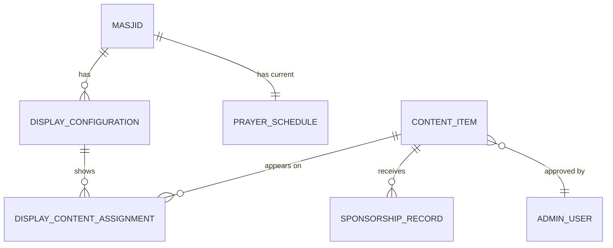

# Data Model: Masjid Digital Display TV App

## Core Entities

### Masjid

**Purpose**: Represents a mosque with display infrastructure and prayer schedule configuration

**Fields**:

- `id`: UUID - Primary key
- `name`: string - Masjid name in Bahasa Malaysia
- `location`: string - Physical address
- `jakim_zone_id`: string - JAKIM API zone identifier for prayer times
- `timezone`: string - Local timezone (e.g., "Asia/Kuala_Lumpur")
- `created_at`: timestamp
- `updated_at`: timestamp

**Relationships**:

- One-to-many with DisplayConfiguration
- One-to-many with ContentItem (through assignments)
- One-to-one with PrayerSchedule

**Validation Rules**:

- `name` required, max 100 characters
- `jakim_zone_id` required, must match JAKIM API zones
- `timezone` must be valid IANA timezone

### ContentItem

**Purpose**: Represents displayable content (YouTube video or image) with sponsorship information

**Fields**:

- `id`: UUID - Primary key
- `title`: string - Content title in Bahasa Malaysia
- `type`: enum('youtube_video', 'image') - Content type
- `url`: string - YouTube URL or image URL
- `thumbnail_url`: string - Preview image URL
- `sponsorship_amount`: decimal(10,2) - Total sponsorship funds
- `duration`: integer - Duration in seconds (for videos) or display time (for images)
- `status`: enum('active', 'inactive', 'pending_approval') - Content status
- `approved_by`: UUID - Reference to admin who approved
- `approved_at`: timestamp
- `created_at`: timestamp
- `updated_at`: timestamp

**Relationships**:

- Many-to-many with Masjid (through DisplayContentAssignment)
- Many-to-one with AdminUser (approved_by)

**Validation Rules**:

- `title` required, max 200 characters
- `url` required, must be valid YouTube URL or image URL
- `sponsorship_amount` must be >= 0
- `duration` must be > 0
- `status` defaults to 'pending_approval'

### DisplayConfiguration

**Purpose**: Configuration settings for a specific display within a masjid

**Fields**:

- `id`: UUID - Primary key
- `masjid_id`: UUID - Foreign key to Masjid
- `display_name`: string - Friendly name for the display
- `prayer_time_position`: enum('top', 'bottom', 'left', 'right', 'center') - Prayer time overlay position
- `carousel_interval`: integer - Seconds between content transitions
- `max_content_items`: integer - Maximum items in carousel (default 10)
- `auto_refresh_interval`: integer - Minutes between data refresh
- `is_active`: boolean - Whether display is currently active
- `last_heartbeat`: timestamp - Last activity from display
- `created_at`: timestamp
- `updated_at`: timestamp

**Relationships**:

- Many-to-one with Masjid
- One-to-many with DisplayContentAssignment

**Validation Rules**:

- `display_name` required, max 50 characters
- `carousel_interval` must be between 5-300 seconds
- `max_content_items` must be between 1-20
- `auto_refresh_interval` must be between 1-60 minutes

### DisplayContentAssignment

**Purpose**: Junction table managing which content appears on which displays

**Fields**:

- `id`: UUID - Primary key
- `display_config_id`: UUID - Foreign key to DisplayConfiguration
- `content_item_id`: UUID - Foreign key to ContentItem
- `priority_order`: integer - Manual ordering override (optional)
- `is_pinned`: boolean - Whether content should always appear
- `created_at`: timestamp

**Relationships**:

- Many-to-one with DisplayConfiguration
- Many-to-one with ContentItem

**Validation Rules**:

- Unique constraint on (display_config_id, content_item_id)
- `priority_order` must be >= 0 if specified

### PrayerSchedule

**Purpose**: Cached prayer times for each masjid

**Fields**:

- `id`: UUID - Primary key
- `masjid_id`: UUID - Foreign key to Masjid
- `prayer_date`: date - Date for these prayer times
- `fajr_time`: time - Fajr prayer time
- `sunrise_time`: time - Sunrise time
- `dhuhr_time`: time - Dhuhr prayer time
- `asr_time`: time - Asr prayer time
- `maghrib_time`: time - Maghrib prayer time
- `isha_time`: time - Isha prayer time
- `source`: string - Data source (e.g., "JAKIM_API")
- `fetched_at`: timestamp - When data was retrieved
- `created_at`: timestamp

**Relationships**:

- Many-to-one with Masjid

**Validation Rules**:

- Unique constraint on (masjid_id, prayer_date)
- All prayer times required
- `prayer_date` cannot be in the future beyond 30 days

### SponsorshipRecord

**Purpose**: Individual sponsorship transactions for content items

**Fields**:

- `id`: UUID - Primary key
- `content_item_id`: UUID - Foreign key to ContentItem
- `sponsor_name`: string - Sponsor name (optional, can be anonymous)
- `amount`: decimal(10,2) - Sponsorship amount
- `currency`: string - Currency code (default 'MYR')
- `transaction_reference`: string - Payment reference
- `sponsored_at`: timestamp
- `created_at`: timestamp

**Relationships**:

- Many-to-one with ContentItem

**Validation Rules**:

- `amount` must be > 0
- `currency` must be valid ISO currency code
- `transaction_reference` should be unique when provided

## State Transitions

### ContentItem Status Flow

```
pending_approval → (admin approval) → active
pending_approval → (admin rejection) → inactive
active → (admin action) → inactive
inactive → (admin action) → active
```

### Display Configuration Lifecycle

```
created → (setup complete) → active
active → (maintenance) → inactive
inactive → (reactivation) → active
```

## Data Relationships Summary



## Performance Considerations

### Indexing Strategy

- Index on `masjid_id` for display configurations
- Index on `sponsorship_amount` for content ranking queries
- Index on `prayer_date` for prayer schedule lookups
- Composite index on (display_config_id, priority_order) for content ordering

### Caching Strategy

- Prayer schedules cached for 24 hours
- Content rankings cached for 1 hour
- Display configurations cached until manual refresh
- Use Redis for real-time data when available

### Query Optimization

- Precompute top 10 content rankings per masjid
- Batch fetch display configurations for multi-display masjids
- Use database views for complex content-sponsorship joins
- Implement pagination for admin content management

## Migration Strategy

### Initial Schema

1. Create base tables (Masjid, ContentItem, DisplayConfiguration)
2. Add foreign key relationships
3. Create indexes for performance
4. Seed with sample data for development

### Future Extensions

- Add content categories and filtering
- Implement content scheduling (time-based display)
- Add analytics tracking for content views
- Support for multi-language content beyond Bahasa Malaysia

## Validation and Constraints

### Business Rules

- Each masjid must have at least one active display configuration
- Content items require approval before appearing on displays
- Prayer times must be refreshed daily
- Sponsorship amounts determine display priority (higher amount = higher priority)
- Display configurations can override global content priority with manual ordering

### Data Integrity

- Soft delete for content items to preserve sponsorship history
- Audit trails for display configuration changes
- Backup prayer schedules for network failure scenarios
- Content URL validation before saving to database
