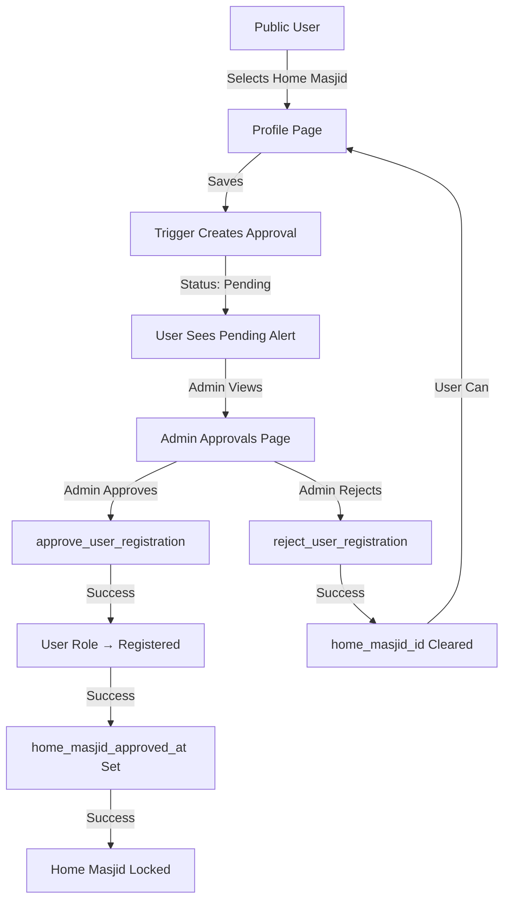

# User Approval System - Feature Complete ✅

## Overview

The User Approval System for E-Masjid.My is now fully implemented and ready for use. Public users can select their home masjid, which creates a pending approval. Masjid admins can review and approve/reject these requests. Once approved, the user's role is upgraded to "registered" and their home masjid selection becomes permanent (locked).

## What's Been Built

### 1. Database Schema ✅

**Files**:

- `supabase/migrations/019_create_user_approvals.sql`
- `supabase/migrations/020_add_user_approvals_rls.sql`

**Components**:

- **user_approvals table**: Tracks approval requests (pending/approved/rejected)
- **profiles.home_masjid_approved_at**: Timestamp for when home masjid was approved
- **Automatic triggers**:
  - Creates approval when public user selects home masjid
  - Updates user role to 'registered' on approval
  - Locks home masjid after approval (immutable)
  - Clears home masjid on rejection
- **Database functions**:
  - `get_pending_user_approvals(masjid_id)` - Get pending list
  - `approve_user_registration(approval_id, approver_id, notes)` - Approve user
  - `reject_user_registration(approval_id, rejector_id, notes)` - Reject user
- **RLS policies**: Masjid-specific access control

### 2. Service Package ✅

**Location**: `packages/user-approval/`

**Features**:

```typescript
import { UserApprovalService } from "@masjid-suite/user-approval";

// Get pending approvals for a masjid
const approvals = await UserApprovalService.getPendingApprovals(masjidId);

// Approve a user
await UserApprovalService.approveUser({
  approval_id: "uuid",
  approver_id: "admin-uuid",
  notes: "Optional notes",
});

// Reject a user (notes required)
await UserApprovalService.rejectUser({
  approval_id: "uuid",
  rejector_id: "admin-uuid",
  notes: "Reason for rejection",
});

// Check if user's home masjid is locked
const status = await UserApprovalService.getHomeMasjidLockStatus(userId);
// Returns: { is_locked: boolean, approved_at: string | null, home_masjid_id: string | null }

// Subscribe to real-time updates
const subscription = UserApprovalService.subscribeToApprovals(
  masjidId,
  (payload) => console.log("Approval updated:", payload)
);
```

### 3. Admin UI ✅

**Location**: `apps/hub/src/pages/admin/UserApprovals.tsx`  
**Route**: `/admin/user-approvals`  
**Access**: Masjid Admin + Super Admin roles only

**Features**:

- 📊 Statistics cards showing pending/approved/rejected counts
- 📋 Tabbed interface (Pending, Approved, Rejected, All)
- 👤 User details display (name, email, phone)
- 🕌 Masjid information
- ✅ Approve button with optional notes
- ❌ Reject button with required reason (min 5 chars)
- 🔔 Real-time updates via Supabase subscriptions
- 🔒 RLS automatically filters to admin's masjids
- ⏱️ Formatted timestamps (Malaysian locale)

**Screenshots** (conceptual):

```
┌─────────────────────────────────────────────────┐
│ User Approvals                        [Refresh] │
├─────────────────────────────────────────────────┤
│  ┌───────┐  ┌───────┐  ┌───────┐               │
│  │   3   │  │   5   │  │   1   │               │
│  │Pending│  │Approved│ │Rejected│              │
│  └───────┘  └───────┘  └───────┘               │
├─────────────────────────────────────────────────┤
│ [Pending] [Approved] [Rejected] [All]           │
├──────────────────────────────────────────────────┤
│ User              Masjid         Submitted      │
│ Ahmad Bin Ali     Masjid Al-    2025-10-03  ✓ ❌│
│ ahmad@email.com   Hidayah                       │
└─────────────────────────────────────────────────┘
```

### 4. Profile UI ✅

**Location**: `apps/hub/src/pages/profile/Profile.tsx`  
**Route**: `/profile`

**Features**:

- 🔓 **Before Approval**: User can select home masjid from dropdown
- ⏳ **Pending State**: Yellow alert shows "Approval Pending" message
- 🔒 **After Approval**:
  - Blue alert shows "Home Masjid Locked" with approval date
  - Dropdown disabled with lock icon
  - Helper text explains permanence
  - Cannot be changed anymore

**UI States**:

```typescript
// Pending Approval (Yellow Alert)
┌─────────────────────────────────────────┐
│ ⏳ Approval Pending                     │
│ Your home masjid selection is waiting  │
│ for admin approval. You will be        │
│ notified once reviewed.                 │
└─────────────────────────────────────────┘

// Locked (Blue Alert)
┌─────────────────────────────────────────┐
│ 🔒 Home Masjid Locked                   │
│ Your home masjid was approved on        │
│ 3 Oktober 2025. You cannot change it   │
│ anymore.                                │
└─────────────────────────────────────────┘

// Dropdown (Locked State)
┌─────────────────────────────────────────┐
│ Home Masjid (Optional) - Locked        │
│ 🔒 Masjid Al-Hidayah - Shah Alam    ▼ │
│ ░░░░░░░░░░░░░░░░░░░░░░░░░░░░░░░░░░░░░  │
│ This field is locked after approval     │
└─────────────────────────────────────────┘
```

## User Flow

### Complete Workflow



### Step-by-Step

1. **Public User Signs Up**
   - User creates account (role: 'public')
   - Completes profile information

2. **User Selects Home Masjid**
   - Goes to `/profile`
   - Selects masjid from dropdown
   - Clicks "Save Profile"
   - Sees "Approval Pending" alert

3. **Database Auto-Creates Approval**
   - Trigger `create_user_approval_on_home_masjid_set()` fires
   - Creates record in `user_approvals` table
   - Status: 'pending'

4. **Admin Reviews Request**
   - Admin navigates to `/admin/user-approvals`
   - Sees pending approval in list
   - Views user details (name, email, phone)
   - Sees which masjid user selected

5. **Admin Approves** ✅
   - Clicks approve button
   - Optionally adds notes
   - Confirms action
   - Function `approve_user_registration()` executes:
     - Updates `users.role` → 'registered'
     - Sets `profiles.home_masjid_approved_at` → NOW()
     - Updates `user_approvals.status` → 'approved'
   - Trigger `prevent_home_masjid_change()` now blocks updates

6. **User Sees Locked State**
   - Refreshes `/profile`
   - Sees "Home Masjid Locked" alert
   - Dropdown is disabled
   - Cannot change selection anymore

**Alternative: Admin Rejects** ❌

- Clicks reject button
- MUST provide reason (min 5 chars)
- Confirms action
- Function `reject_user_registration()` executes:
  - Sets `profiles.home_masjid_id` → NULL
  - Updates `user_approvals.status` → 'rejected'
- User can select a different masjid (creates new approval)

## Technical Details

### Database Triggers

1. **create_user_approval_on_home_masjid_set()**
   - **When**: `profiles.home_masjid_id` is updated
   - **Who**: Public users only
   - **Action**: Creates pending approval record
   - **Validation**: Only for public users, not admins

2. **process_approved_user()**
   - **When**: `user_approvals.status` changes to 'approved'
   - **Action**:
     - Updates user role to 'registered'
     - Sets home_masjid_approved_at timestamp
   - **Result**: User is promoted

3. **prevent_home_masjid_change()**
   - **When**: Attempt to update `profiles.home_masjid_id`
   - **Check**: If `home_masjid_approved_at IS NOT NULL`
   - **Action**: Raises exception (blocks update)
   - **Message**: "Cannot change home masjid after approval"

### RLS Policies

```sql
-- Admins can only see approvals for their masjids
CREATE POLICY "view_user_approvals" ON user_approvals
  FOR SELECT
  TO authenticated
  USING (
    home_masjid_id = ANY(get_user_admin_masjids())
  );
```

### Real-Time Subscriptions

```typescript
// Auto-reloads approval list when changes occur
supabase
  .channel("user-approvals")
  .on(
    "postgres_changes",
    {
      event: "*",
      schema: "public",
      table: "user_approvals",
    },
    () => loadApprovals()
  )
  .subscribe();
```

## Testing Checklist

### Manual Testing

#### ✅ Happy Path: Approval Flow

```bash
# 1. Create public user account
# 2. Go to /profile
# 3. Select home masjid from dropdown
# 4. Click "Save Profile"
# Expected: See "Approval Pending" alert

# 5. Login as masjid admin
# 6. Go to /admin/user-approvals
# Expected: See pending approval in list

# 7. Click approve button
# 8. Optionally add notes
# 9. Confirm approval
# Expected: Success message, approval moved to "Approved" tab

# 10. Logout, login as original user
# 11. Go to /profile
# Expected:
#   - See "Home Masjid Locked" alert with approval date
#   - Dropdown disabled with lock icon
#   - Cannot change selection

# 12. Try to manually update database
UPDATE profiles SET home_masjid_id = 'different-uuid' WHERE user_id = 'user-uuid';
# Expected: ERROR - Cannot change home masjid after approval
```

#### ✅ Rejection Flow

```bash
# 1-6: Same as above

# 7. Click reject button
# 8. Enter rejection reason (min 5 chars)
# 9. Confirm rejection
# Expected: Success message, approval moved to "Rejected" tab

# 10. Logout, login as original user
# 11. Go to /profile
# Expected:
#   - No pending alert
#   - Home masjid cleared
#   - Can select again (creates new approval)
```

#### ✅ Real-Time Updates

```bash
# 1. Admin opens /admin/user-approvals in Browser A
# 2. Public user selects home masjid in Browser B
# Expected: Approval appears in Browser A without refresh

# 3. Admin approves in Browser A
# Expected: Count updates automatically, approval moves to "Approved" tab
```

### Database Testing

```sql
-- Test approval creation
INSERT INTO profiles (user_id, home_masjid_id)
VALUES ('public-user-uuid', 'masjid-uuid');

SELECT * FROM user_approvals WHERE user_id = 'public-user-uuid';
-- Expected: One pending approval record

-- Test approval
SELECT approve_user_registration('approval-uuid', 'admin-uuid', 'Approved');

SELECT role FROM users WHERE id = 'public-user-uuid';
-- Expected: 'registered'

SELECT home_masjid_approved_at FROM profiles WHERE user_id = 'public-user-uuid';
-- Expected: Recent timestamp

-- Test lock
UPDATE profiles
SET home_masjid_id = 'different-masjid-uuid'
WHERE user_id = 'public-user-uuid';
-- Expected: ERROR - Cannot change home masjid after approval

-- Test rejection
SELECT reject_user_registration('approval-uuid', 'admin-uuid', 'Reason here');

SELECT home_masjid_id FROM profiles WHERE user_id = 'public-user-uuid';
-- Expected: NULL
```

## Configuration

### Environment Variables

No additional environment variables required. Uses existing Supabase configuration.

### Database Migrations

```bash
# Migrations already applied during implementation
# 019_create_user_approvals.sql
# 020_add_user_approvals_rls.sql

# To re-run on fresh database:
cd /Users/rohaizan/Codes/ai-gen/agent-1-emasjid-my
supabase db reset
./scripts/setup-supabase.sh
```

### Package Dependencies

```json
{
  "@masjid-suite/user-approval": "workspace:*"
}
```

## Usage Examples

### For Developers

```typescript
// In a React component
import { UserApprovalService } from '@masjid-suite/user-approval';
import { useEffect, useState } from 'react';

function MyComponent() {
  const [approvals, setApprovals] = useState([]);

  useEffect(() => {
    // Load approvals
    UserApprovalService.getPendingApprovals('masjid-id')
      .then(setApprovals);

    // Subscribe to changes
    const sub = UserApprovalService.subscribeToApprovals(
      'masjid-id',
      () => {
        // Reload on change
        UserApprovalService.getPendingApprovals('masjid-id')
          .then(setApprovals);
      }
    );

    return () => sub.unsubscribe();
  }, []);

  const handleApprove = async (approvalId) => {
    await UserApprovalService.approveUser({
      approval_id: approvalId,
      approver_id: 'current-admin-id',
      notes: 'Looks good!'
    });
  };

  return (
    <div>
      {approvals.map(approval => (
        <div key={approval.id}>
          <p>{approval.user?.full_name}</p>
          <button onClick={() => handleApprove(approval.id)}>
            Approve
          </button>
        </div>
      ))}
    </div>
  );
}
```

## Known Limitations

1. **No Email Notifications**: Users are not notified via email when approved/rejected
2. **No Bulk Operations**: Admins must approve/reject one at a time
3. **No Filtering**: Cannot filter by masjid if admin manages multiple masjids
4. **No Export**: Cannot export approval history to CSV/PDF
5. **No Analytics**: No dashboard showing approval trends over time

## Future Enhancements

1. **Email Notifications** 📧
   - Send email when approval is pending
   - Send email on approval
   - Send email on rejection with reason

2. **Bulk Operations** 📦
   - Select multiple approvals
   - Approve/reject in bulk
   - Add same notes to multiple

3. **Advanced Filtering** 🔍
   - Filter by masjid (for multi-masjid admins)
   - Filter by date range
   - Search by user name/email

4. **Analytics Dashboard** 📊
   - Approval rate metrics
   - Time to approval statistics
   - Rejection reasons analysis

5. **Notification System** 🔔
   - In-app notifications
   - Badge count in navbar
   - Desktop notifications

## Support & Documentation

- **Specification**: `specs/005-user-approval-system/spec.md`
- **Quickstart**: `specs/005-user-approval-system/quickstart.md`
- **Status**: `specs/005-user-approval-system/IMPLEMENTATION_STATUS.md`
- **This Document**: `specs/005-user-approval-system/FEATURE_COMPLETE.md`

## Deployment Checklist

- [x] Database migrations applied
- [x] Service package built and published
- [x] Hub app includes new pages
- [x] Routes configured
- [x] Build passes
- [x] Dev server runs
- [ ] Manual QA completed
- [ ] Automated tests written
- [ ] Production deployment

---

**Status**: ✅ Feature Complete - Ready for QA & Testing  
**Build**: ✅ All packages compile successfully  
**Dev Server**: ✅ Running on http://localhost:3000  
**Last Updated**: 4 October 2025

## Quick Links

- Admin UI: http://localhost:3000/admin/user-approvals
- Profile UI: http://localhost:3000/profile
- Package: `packages/user-approval/`
- Migrations: `supabase/migrations/019_*.sql` and `020_*.sql`
